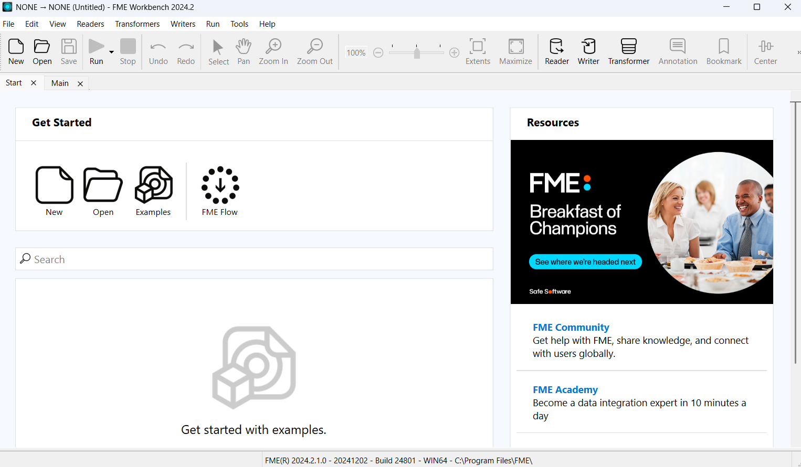
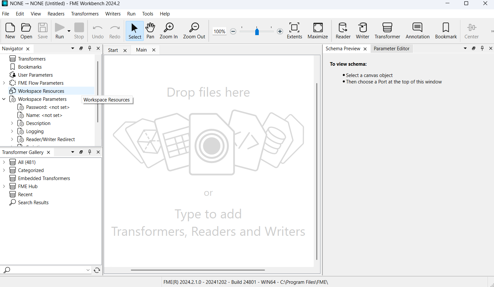
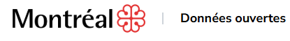
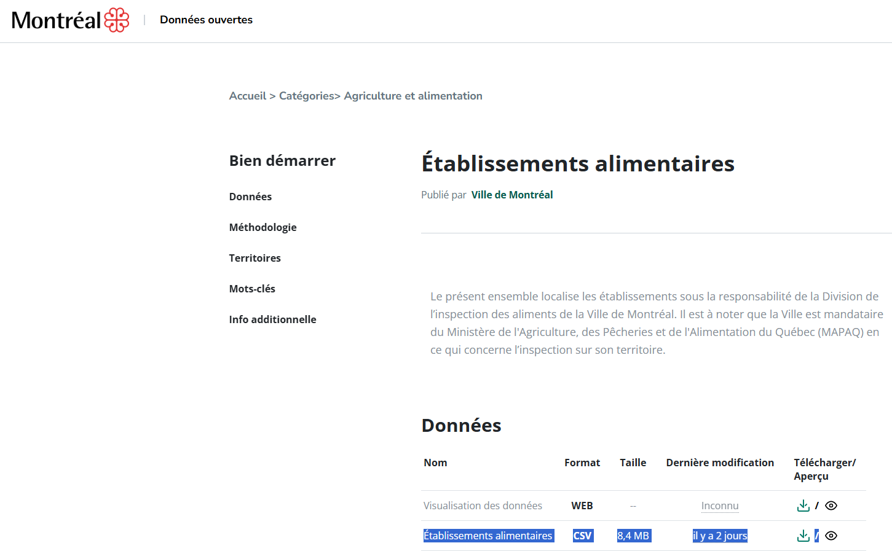
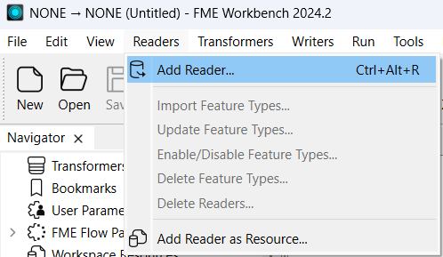
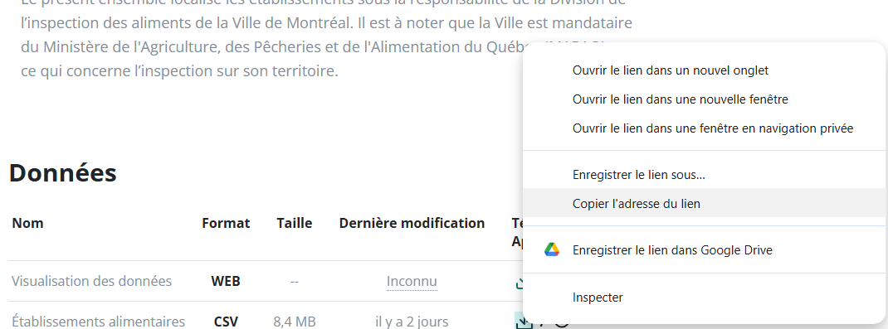
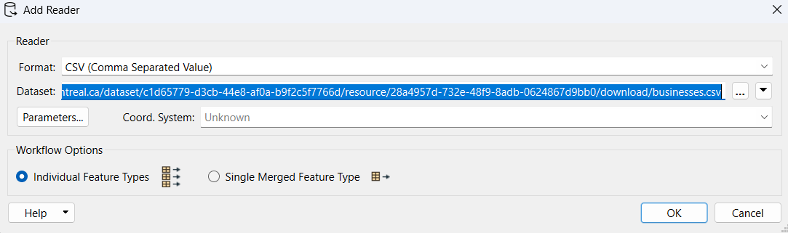
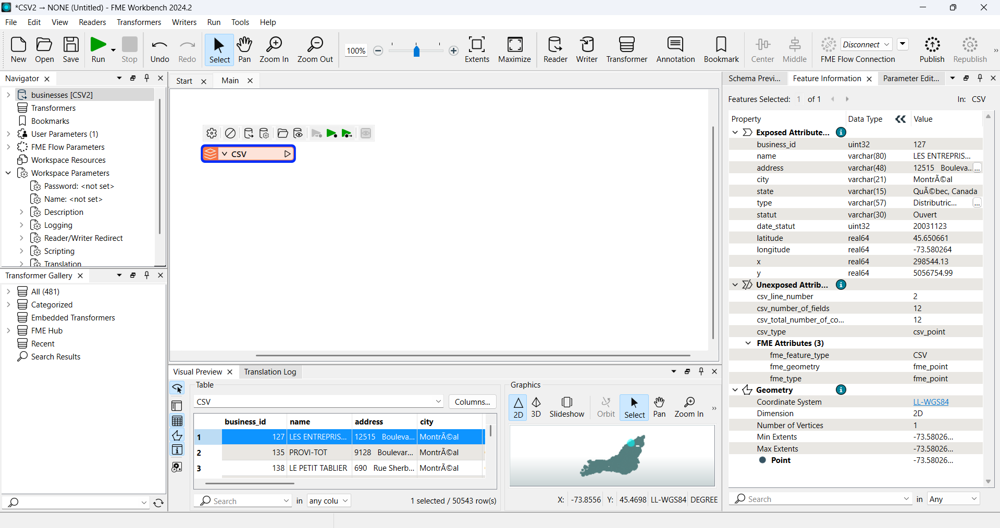
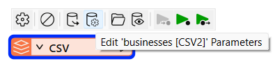
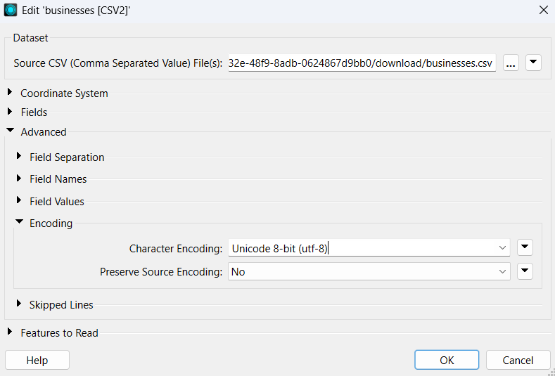

# Compte Rendu de TP

## Introduction
Décrivez ici l'objectif du TP et les concepts théoriques abordés.

## Matériel et Méthodes
Listez le matériel utilisé et les étapes méthodologiques suivies.

### Matériel
- Élément 1
- Élément 2

### Étapes
1. Étape 1 :Ouvrir FME et Création d'un nouveau projet :

2. Étape 2 :Lecture du CSV 

   1- Input : Établissements alimentaires de Montréal 
Avec les données d'adresse,Longitude et Latitude

Ces données sont extraites du site des données ouvertes de la ville de Montréal

   

   Au lieu de telecharger le fichier, on aura a copier l'adresse lien puis l'ajouter au Reader sur FME

   

Puis on suit les étapes suivantes sur Reader-FME,tout en prenant en compte le format CSV du fichier :

HOURAAA,le fichier s'est lié sans erreurs.

Mais on peut voir quelques erreurs dans les ecritures (des accents....)
Pour remedier a ce probléme on suit les étapes suivantes :

Et voila,pas d'erreur d'ecriture 

3. Étape 3: Injection d'un table    
4. Étape 4
5. Étape 5
6. Étape 6
7. Étape 7
8. Étape 8
9. Étape 9
10. Étape 10
11. Étape 11
12. Étape 12
13. Étape 13
14. Étape 14

## Résultats
Présentez les résultats obtenus sous forme de texte, tableaux ou graphiques.

## Discussion
Analysez les résultats, comparez-les aux attentes et discutez des éventuelles erreurs.

## Conclusion
Résumé des principaux points et des conclusions tirées du TP.

## Références
Listez les sources et références utilisées pour le TP.

