## 📌Description et objectifs du TP📌

Le but du TP est de faire rouler les données, valider , nettoyer , reprojeter et analyser et ainsi faire les calculs nécessaire pour le bon déroulement du TP 

## Étapes :

Les étapes seront les suivantes associées a des captures et des explications pour chaque étape :

**📊1-Lire les données**
Dans cette étape le but est de lire les données pertinentes pour notre projet (les données ont été pré-filtrées selon la disponibilité de la donnée ,de sa date de mise a jour ainsi que la necessité des données)

Pour lire les données on doit utiliser des reader (pour Geojson ou CSV...)

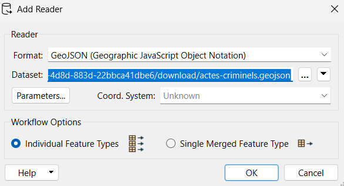

et nos données sont associer a notre fichier FME

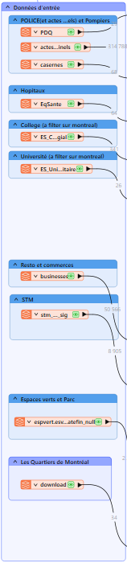

**2-🚀Valider l'intégrité des données**

on utilise le bouton magique ''RUN'' et on verifie nos données :

nos données ont des coordoonées et infos necessaires pour notre analyse

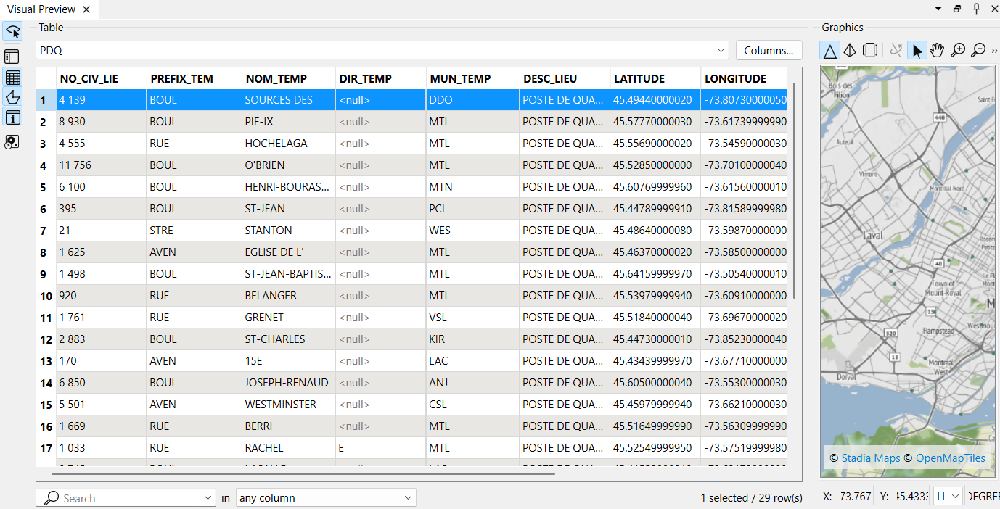

Si mes données ne contiennt pas de coordonées XY et longitude latitude on utilise un CoordinateExtractor :

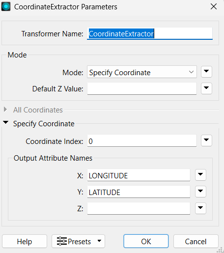

**3-🧹Nettoyer les données**

Bien que quelque données ne sont pas si importante pour la suite de notre analyse il vaut mieux faire un petit nettoyage pour ne garder que l'essentiel :

Pour cela on utilise un attribute manager :

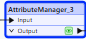

et on applique un remove sur ce qu'on veut pas 

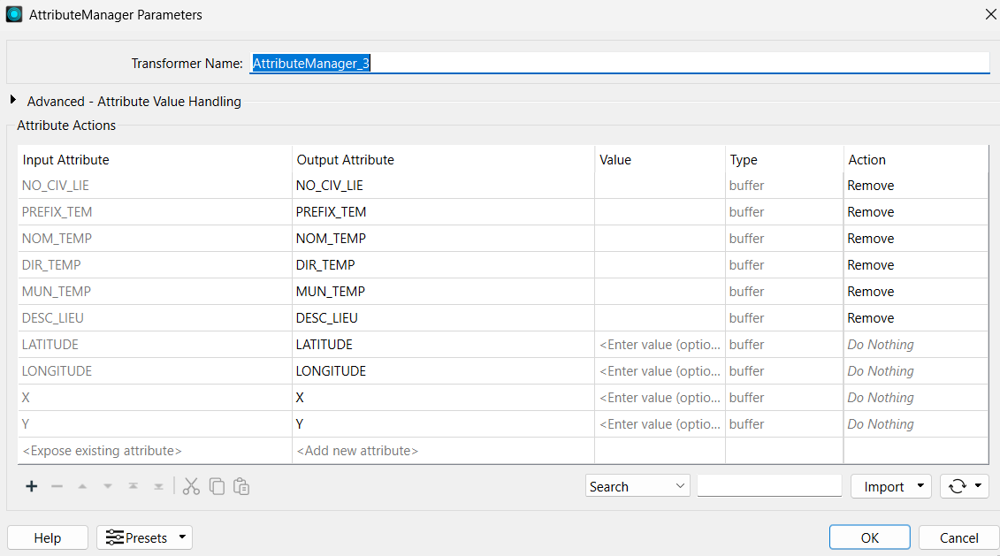

MAIS!! quelques données proviennent de la province du Québec donc on se doit de filtrer sur la ville de montréal avec l'aide de l'attribute filter :

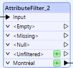

on aura un output que sur la ville de montréal

et aussi pour la donnée des commerces on filtre sur ceux qui sont toujours ouverts seulements ;

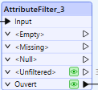

**4-Reprojection 🗺 ➡️ 🗾**

la suite de notre analyse necessite une reprojection vers un le systéme EPSG:3857

le transformateur reprojector repond a notre besoin dans cette étape :

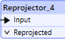

et on y applique un tester pour voir si la reprojection s'est faite sans erreur et que tout est bien fait ;

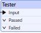 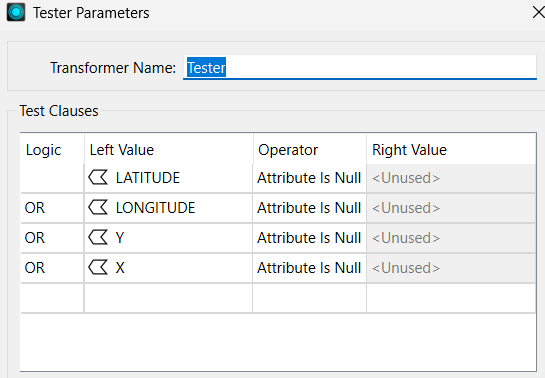

**5-Analyse🔍 et calcul🧮**

le but de l'analyse est de calculer combien de comodités sont disponible dans chaque quartiers de montréal afin d'attribuer un score a chaque quartier suivant les critéres qu'on a choisi

le transformateur pointonareaoverlayer permets de compter les points dans chaque zone mais la question qu'on doit se poser c'est comment determiner la zone , pour cela l'idée de générer une grille hexagonale nous viens a l'esprit 

on procéde en suivant les etapes suivantes :

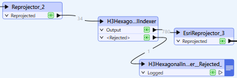

1-Reprojeter selon les besoin du transformateur H3indexer

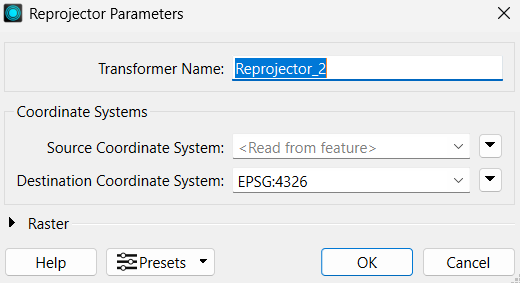

Car le h3indexer demande en entrée le systeme 4326

2-Parametrer le transformateur 

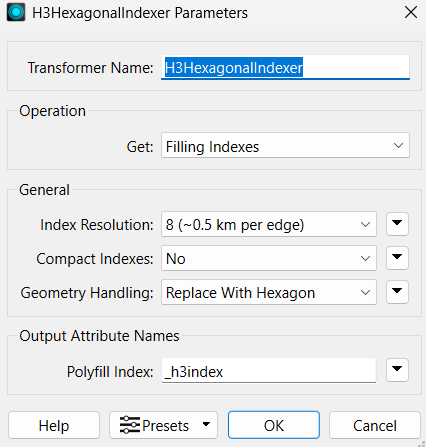

3-reprojeter en EPSG:3857

Résultat :

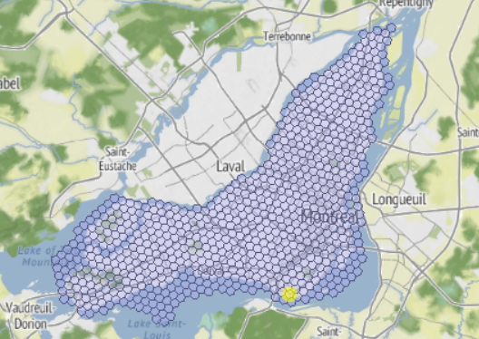

pour la donnée des parcs et espaces verts on peut rencontrer le meme probleme donc on genere des points a l'interieur de nos espaces de parcs avec le Random Point Generator 

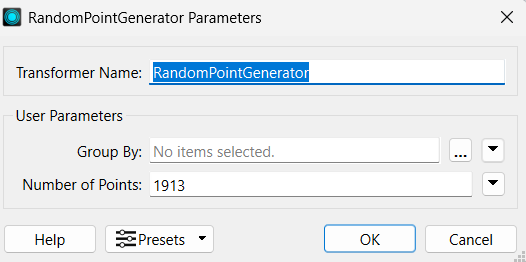

Ainsi on pour le pointOnAreaOverLayer on aura nos points et notre Area qui est la grille hexagonale 

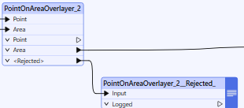

Petit conseil : Connecter un logger c'est bien.

on sait combien chaque hexagone a des points a l'interieur 

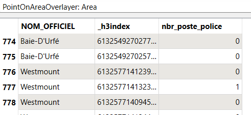

la suite de l'analyse necessite un statistic calculator pour deduire le minimum et la maximum de chaque critére calculée.

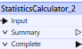 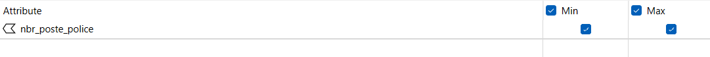

puis un attribute creator dans le but de calculer un score normalisé et un score suivant une ponderation pour chaque hexagone 

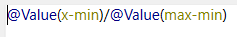 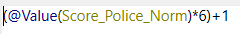  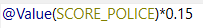

Pour attribuer une note pour chaque hexagone correspendant a un quartier on se doit de joindre les données car chaque données a été chargé modifier et associée a un hexagone séparement, le FeatureJoiner est un transformateur qui va nous permettre de faire cette opération on joingnant les resultat précedent sur la base des numeros d'hexagone comme suit :

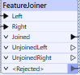 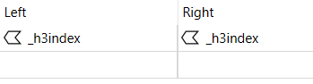

Ensuite , un petit ménage qui fait du bien ;

Merci attribute manager 

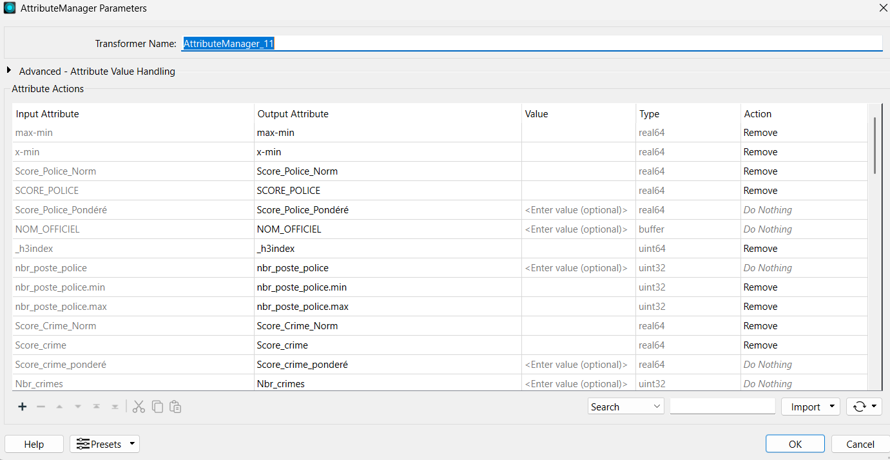

Maintenant je peux donner un score a mes quartiers et les classer 

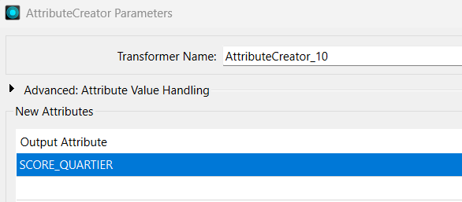

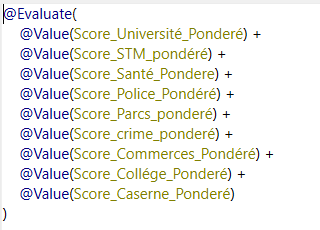

et voici mon classement 

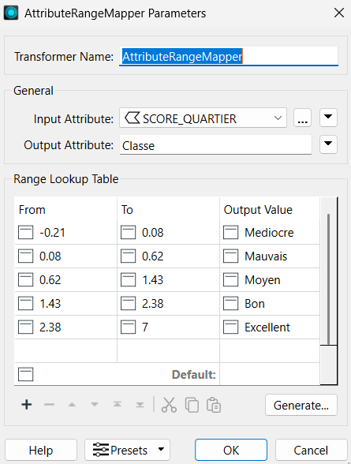
## 📍Visualisation sur Qgis📍 
Pour visualiser notre résultats sur QGis lance un PostGIS Writer et on aura :

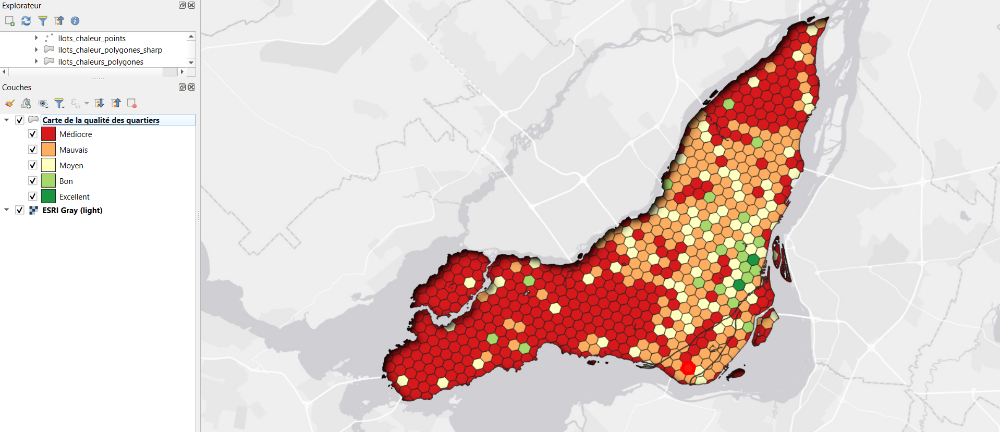

